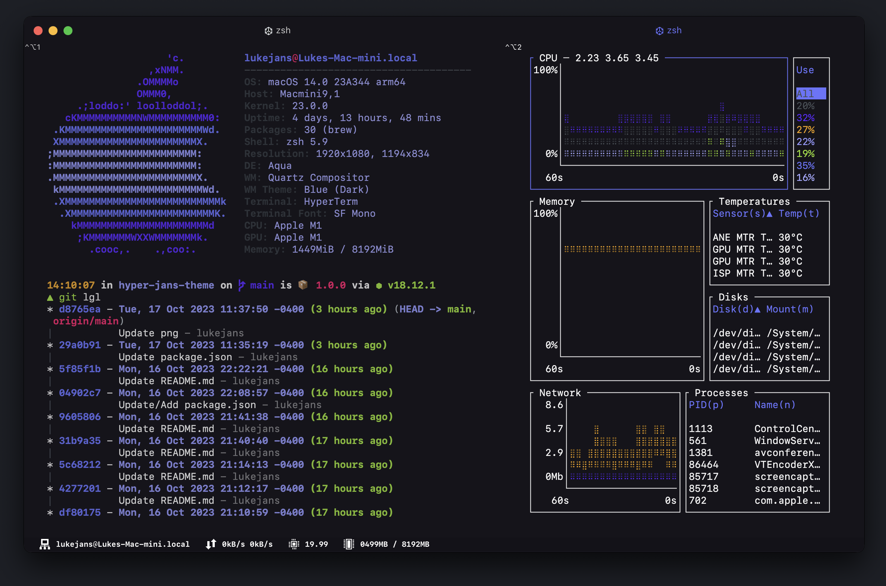

<h1 align="center"><b>hyper-jans-theme</b></h1>

<a href="https://www.linkedin.com/in/luke-janssen-96592a245/" target="_blank">

</a>
<a href="https://twitter.com/lukejanss" target="_blank">

</a>
<a href="https://github.com/lukejans" target="_blank">

</a>
<a href="https://hyper.is/" target="_blank">

</a>

> Just a colorful dark theme built for [Vercel's](https://vercel.com/) terminal [Hyper.js](https://hyper.is/).

## Installation Options

Ensure you have [Hyper.js](https://hyper.is) terminal installed. If not, run the following command from your terminal.

```zsh
$ brew install --cask hyper
```

#### **Option 1:** Hyper plugin manager

Then run the following from the command line:

```zsh
$ hyper install hyper-jans-theme
```

#### **Option 2:** Manually

Open your `~/.hyper.js` configuration file and add `"hyper-jans-theme"` to your plugins section.

```js
  plugins: [...'hyper-jans-theme'],
```

Save changes made to `~./hyper.js`, reload your terminal and happy coding!

## My `~/.hyper.js` Configuration

```js
module.exports = {
  config: {
    fontSize: 13,
    // font family with optional fallbacks
    fontFamily: '"SF Mono", "Fira Code", monospace',
    // custom padding (CSS format, i.e.: `top right bottom left`)
    padding: '12px 30px 40px 30px',
    // hyperline configuration
    hyperline: {
      plugins: ['hostname', 'network', 'cpu', 'memory'],
    },
  },
  // a list of plugins to fetch and install from npm
  plugins: ['hyperline', 'hyper-pane'],
};
```

> Here I use [SF Mono](https://developer.apple.com/fonts/) for my font with [Fira Code](https://fonts.google.com/specimen/Fira+Code) as a fallback for powerline icons. I also added some additional padding to accommodate for the [hyperline plugin](https://github.com/Hyperline/hyperline) I use.
